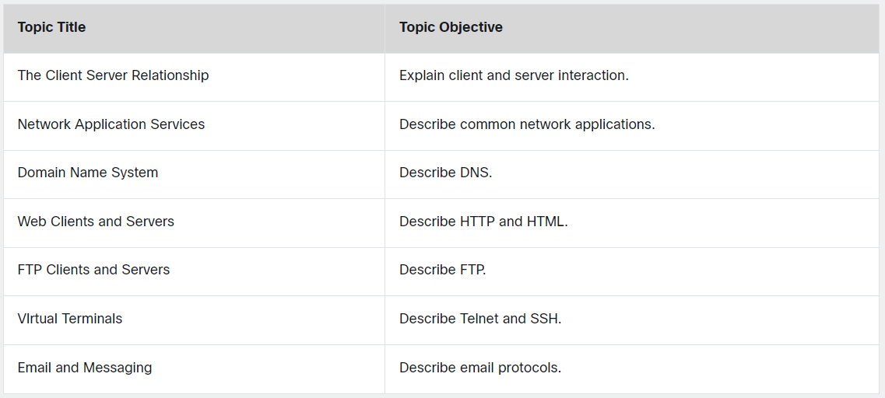
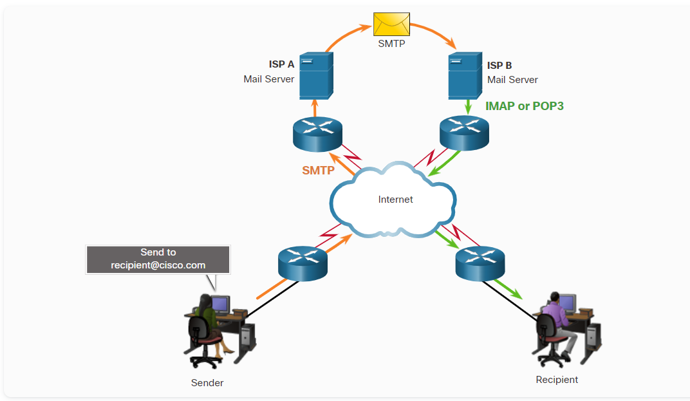
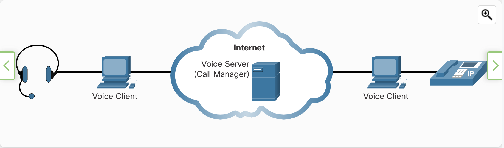

**URI, URN, and URL**
Web resources and web services such as RESTful APIs are identified using a Uniform Resource Identifier (URI). A URI is a string of characters that identifies a specific network resource. As shown in the figure, a URI has two specializations:

- *Uniform Resource Name (URN)* \- This identifies only the namespace of the resource (web page, document, image, etc.) without reference to the protocol.
- Uniform Resource Locator (URL) - This defines the network location of a specific resource on the network. HTTP or HTTPS URLs are typically used with web browsers. Other protocols such as FTP, SFTP, SSH, and others can be used as a URL. A URL using SFTP might look like: sftp://sftp.example.com.

* * *

These are the parts of a URI, as shown in the figure:

Protocol/scheme - HTTPS or other protocols such as FTP, SFTP, mailto, and NNTP
Hostname - www.example.com
Path and file name - /author/book.html
Fragment - #page155

* * *

**Network Application Service**

```
The HTTP protocol is not a secure protocol. <br>


```

**Email Clients and Servers**
Email is one of the most popular **client/server applications** on the internet.
Many internet messaging system use a web-based client to access email.

* * *

**Email Protocols**

*Simple Mail Transfer Protocol*(SMTP)
SMTP is used by an email client to send messages to its local email server.
**SMTP requests are sent to port 25**.

*Post Office Protocol*(POP3)
A server that supports POP clients receives and stores messages addressed to its users.
**Clients contact POP3 servers on port 110**

*Internet Message Access Protocol*(IMAP4)
A server that supports IMAP4 is received and stored  messages to its user.
**The most current of IMAP and IMAP4 which listens for clients request on port 143.**

**Many different email servers exist for the various network operating system platforms.**

***
**Internet Phone Calls**
An internet telephony clients uses peer-to-peers technology.
IP telephony makes use of Voice over IP(VoIP). which converts analog voice signal to the digital data.
**A call to a regular telephone (landline or cell phone) requires using a gateway to access the Public Switched Telephone Network (PSTN).**

