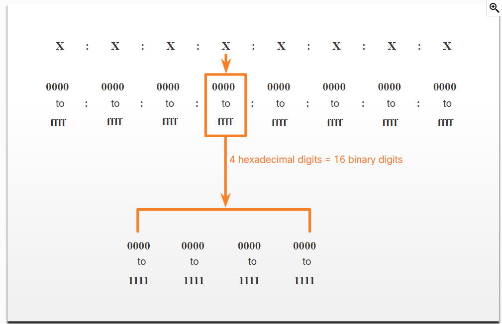

**The Need for IPv6**

You already know that IPv4 is running out of addresses. That is why you need to learn about IPv6.

***
**Dual stack**
Dual stack allows IPv4 and IPv6 to coexist on the same network segment. Dual stack devices run both IPv4 and IPv6 protocol stacks simultaneously. Known as native IPv6, this means the customer network has an IPv6 connection to their ISP and is able to access content found on the internet over IPv6.\
***
**Tunneling**
Tunneling is a method of transporting an IPv6 packet over an IPv4 network. The IPv6 packet is encapsulated inside an IPv4 packet, similar to other types of data.
***
**Translation**
Network Address Translation 64 (NAT64) allows IPv6-enabled devices to communicate with IPv4-enabled devices using a translation technique similar to NAT for IPv4. An IPv6 packet is translated to an IPv4 packet and an IPv4 packet is translated to an IPv6 packet.

****
****
**IPv6 Addressing** (**hexadecimal number system**)
- IPv6 numbers are using hexadecimal numbers. 
- based sixteen number system uses the digits to 0 to 9 and the letters A to F.
- 16 numbers are represented as hextets.
***
**IPv6 Addressing**(**Formating system**)
- IPv6 are 128 bits in length and written as a string of hexadecimal values.
- every four bits is represented by a single hexadecimal digit.

***
***

