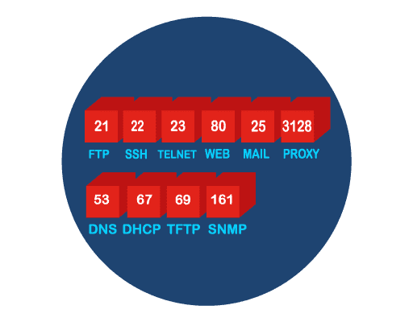

**Port Numbers**

Well-Known Ports - Destination ports that are associated with common network applications are identified as well-known ports. These ports are in the range of 1 to 1023.
Registered Ports - Ports 1024 through 49151 can be used as either source or destination ports. These can be used by organizations to register specific applications such as IM applications.
Private Ports - Ports 49152 through 65535 are often used as source ports. These ports can be used by any application.