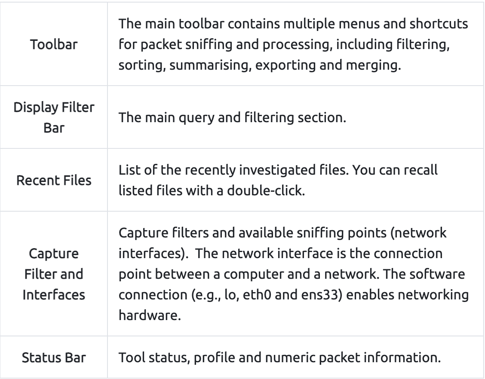

HTTPS Traffic Overview

Before sending encrypted information the client and server need to agree upon various steps in order to make a secure tunnel.

Client and server agree on a protocol version
Client and server select a cryptographic algorithm
The client and server can authenticate to each other; this step is optional
Creates a secure tunnel with a public key
***

